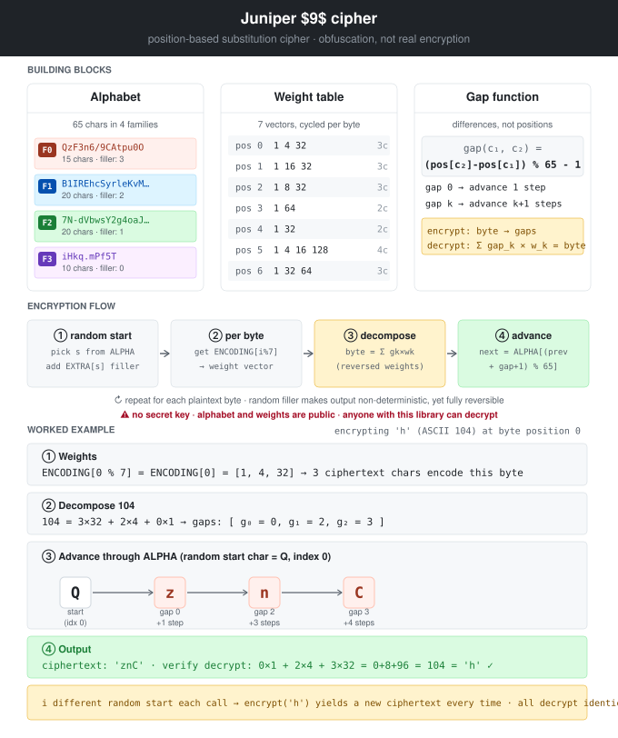

# juniper9-crypt

Encrypt and decrypt Juniper `$9$` reversible passwords, from the command line or Python.

The `$9$` algorithm is a proprietary Juniper substitution cipher. It is **deterministic and device-independent**: a password encrypted on one Juniper device can be decrypted on any other, with no node-specific secret involved. The algorithm and its character set are publicly documented.

> `$9$` is a substitution cipher, not real cryptography. Treat it as obfuscation, not protection. Anyone with this library (or the source of any Juniper device) can recover the plaintext.

## Run without installing

If you have [uv](https://github.com/astral-sh/uv) installed, `uvx` runs the CLI without installing anything:

```bash
uvx juniper9-crypt --decrypt '$9$FNkC3/t1IcevLuOWx'
```

> **Don't have `uv` yet?** Get it. It's the best thing to happen to Python tooling in years.

## Install

```bash
pip install juniper9-crypt
```

Or with `uv`:

```bash
uv add juniper9-crypt
```

## Command-line usage

```bash
# Decrypt a $9$ value
juniper9-crypt --decrypt '$9$FNkC3/t1IcevLuOWx'

# Encrypt a plaintext
juniper9-crypt --encrypt 'mysecret'

# Check a $9$ value against a plaintext or another $9$ value
juniper9-crypt --check '$9$FNkC3/t1IcevLuOWx' 'hello'
juniper9-crypt --check '$9$FNkC3/t1IcevLuOWx' '$9$o1aGiPfz/Cuk.tO'
```

> Always quote `$9$` strings with single quotes - the shell expands `$9` as a positional parameter otherwise.

### Exit codes

| Code | Meaning                              |
|------|--------------------------------------|
| 0    | Success (or `--check` matched)       |
| 1    | `--check` mismatched                 |
| 2    | Invalid input (decrypt error, etc.)  |

### Example output

```
$ juniper9-crypt --decrypt '$9$FNkC3/t1IcevLuOWx'
hello

$ juniper9-crypt --encrypt 'hello'
$9$o1aGiPfz/Cuk.tO

$ juniper9-crypt --check '$9$FNkC3/t1IcevLuOWx' 'hello'
Value 1   : 'hello'
Value 2   : 'hello'
Match     : YES
```

`--encrypt` output varies on every run: the algorithm inserts random filler characters, so the same plaintext produces a different ciphertext each time. They all decrypt back to the same plaintext.

## Python API

```python
from juniper9_crypt import decrypt, encrypt, check

# Decrypt
plain = decrypt("$9$FNkC3/t1IcevLuOWx")
# 'hello'

# Encrypt (non-deterministic)
ciphertext = encrypt("hello")
# '$9$o1aGiPfz/Cuk.tO'  (or any other valid $9$ form)

# Compare a $9$ value against a plaintext
plain_a, plain_b, match = check("$9$FNkC3/t1IcevLuOWx", "hello")
assert match is True

# Compare two $9$ values
plain_a, plain_b, match = check(
    "$9$FNkC3/t1IcevLuOWx",
    encrypt("hello"),
)
assert match is True
```

### Error handling

`decrypt()` raises `ValueError` for malformed inputs:

```python
from juniper9_crypt import decrypt

try:
    decrypt("not-a-juniper-string")
except ValueError as e:
    print(f"bad input: {e}")
```

## Tests

```bash
git clone https://github.com/antoinekh/juniper9-crypt
cd juniper9-crypt
uv run pytest -v
```

## Credits

I'm not nearly smart enough to have reverse-engineered Juniper's `$9$` cipher on my own. This package is a small refactor on top of work done by people who actually figured it out, with packaging, tests, and the Python API cleanup done by me with help from Claude.

- [`Crypt::Juniper`](https://metacpan.org/pod/Crypt::Juniper) - original Perl module by Kevin Brintnall (the real reverse-engineering work)
- [`junosdecode`](https://github.com/mhite/junosdecode) - Python 2 port by Matt Hite (where the Python implementation comes from)
- This package - Python 3 port, type hints, `encrypt()` fix, `check()` API, CLI, tests, and PyPI packaging

## Algorithm



`$9$` is a position-based substitution cipher with three moving parts: a fixed 65-character alphabet split into families, a fixed weight table per output position, and a chain of "gaps" between successive alphabet positions.

### Building blocks

**1. The alphabet.** 65 characters split into four ordered families:

```python
FAMILY = [
    "QzF3n6/9CAtpu0O",          # family 0 (15 chars)
    "B1IREhcSyrleKvMW8LXx",     # family 1 (20 chars)
    "7N-dVbwsY2g4oaJZGUDj",     # family 2 (20 chars)
    "iHkq.mPf5T",               # family 3 (10 chars)
]
ALPHA = "".join(FAMILY)         # 65 chars total
```

Each character has a fixed index 0-64 in `ALPHA`. The family a character belongs to controls how much "filler" is inserted after it (see step 4).

**2. The weight table.** A cycle of 7 weight vectors, one per output byte position:

```python
ENCODING = [
    [1, 4, 32],         # byte 0
    [1, 16, 32],        # byte 1
    [1, 8, 32],         # byte 2
    [1, 64],            # byte 3
    [1, 32],            # byte 4
    [1, 4, 16, 128],    # byte 5
    [1, 32, 64],        # byte 6
]
```

The weights for byte `i` are `ENCODING[i % 7]`. Their length (2-4) tells you how many ciphertext characters encode that byte. The weights are bases in a **mixed-radix** number system: an output byte `b` is decomposed as `b = g0*w0 + g1*w1 + ...` where each `gk` is a small "gap" value.

**3. The gap.** The cipher never stores absolute positions - only gaps between consecutive characters:

```python
gap(c1, c2) = (NUM[c2] - NUM[c1]) % 65 - 1
```

So a gap of 0 means "the next character in `ALPHA`", a gap of 1 means "skip one", etc. Gaps are taken modulo 65, so the alphabet wraps.

### Encryption

To encrypt a plaintext like `"hi"`:

1. **Pick a random start character** from `ALPHA`. Call it `s`. Output: `$9$s`.
2. **Insert filler.** Look up `EXTRA[s]` (a value 0-3 depending on which family `s` belongs to). Append that many random characters from `ALPHA`. This filler is decorative - it's discarded on decrypt. It exists purely to randomize the visual appearance of the output.
3. **For each plaintext byte** (in order):
   - Look up the weights `w = ENCODING[i % 7]` for this position.
   - Decompose the byte's value into gaps using the weights:
     - `gap_last = byte // w_last`, `remainder = byte % w_last`
     - Repeat down through the weights.
   - For each gap, advance from the previous output character by `gap + 1` positions in `ALPHA` (mod 65) to find the next output character.
   - Append those characters to the output.

Because step 1 is random, the same plaintext produces a different ciphertext every call. But because the math is fully reversible, all those ciphertexts decrypt back to the same plaintext.

### Decryption

1. **Strip `$9$`** and read the first character `s`.
2. **Skip `EXTRA[s]` filler characters.**
3. **Walk the rest in chunks**, sized by `ENCODING[i % 7]` for each output byte `i`:
   - For each character in the chunk, compute the gap from the previous character.
   - Multiply each gap by its corresponding weight and sum: `byte = g0*w0 + g1*w1 + ...`
   - Take `byte % 256` and emit it as the plaintext character.

### A worked micro-example

Encrypting the single byte `'h'` (ASCII 104) at byte position 0, starting from previous character `Q` (index 0 in `ALPHA`):

- Weights: `[1, 4, 32]` - the byte is decomposed as `g2*32 + g1*4 + g0*1`.
- Decompose: `104 = 3*32 + 2*4 + 0*1` - so gaps are `[g0=0, g1=2, g2=3]`.
- Walk forward in `ALPHA`, advancing `gap + 1` positions each step:
  - From `Q` (index 0), advance `0+1 = 1` - index 1 - `z`
  - From `z` (index 1), advance `2+1 = 3` - index 4 - `n`
  - From `n` (index 4), advance `3+1 = 4` - index 8 - `C`
- The three output characters for the byte `'h'` are `znC`.

On decryption, the chain `Q - z - n - C` is read back: gaps `0, 2, 3`, recombined as `0*1 + 2*4 + 3*32 = 104 = 'h'`.

### Why it's weak

There is no key. The alphabet, families, and weight tables are constants baked into every Juniper device and every implementation (including this one). Anyone with the ciphertext can recover the plaintext using only public information. `$9$` is obfuscation, not encryption - it stops shoulder-surfing in a config dump, nothing more.

## License

[MIT](LICENSE)
